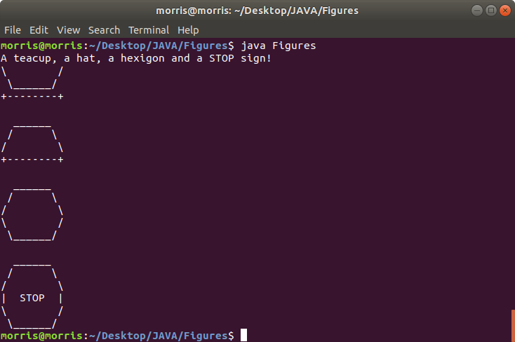

# OOP-JAVA-Winter2020

***Object Oriented Programming course*** 

***This Repository contains Java programs worked on throughout Winter Semester***

 

 

***Chapter1 Exercises*** 

***Exercises 1-3***

***Exercises 4-6***

***Exercises 7-9***

***Exercises 10-12***

***Exercises 13-15***

***Exercises 16-17***

