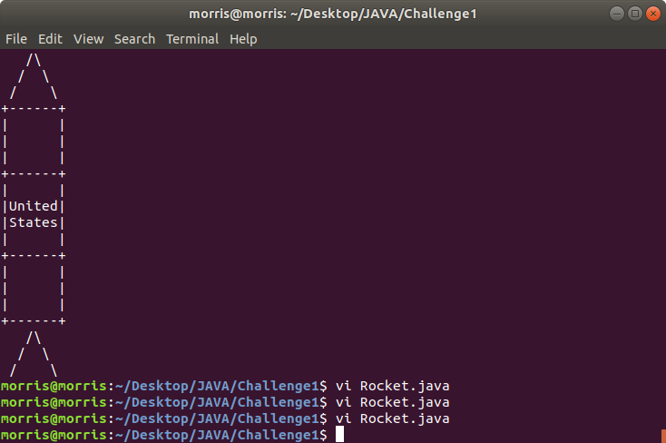
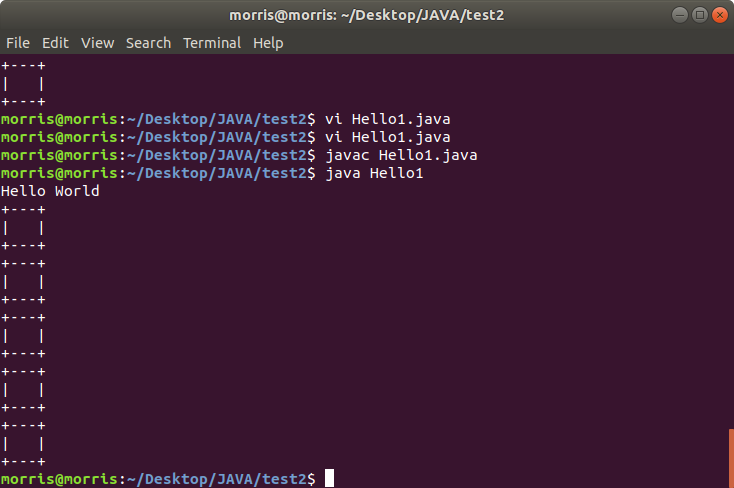

# OOP-JAVA-Winter2020

***Object Oriented Programming course*** 

***Below are some of the assignments I've worked on Winter Semester***

***Introduction Challenge1: Creating a Rocket***
This exercise was introduced in our first class and seemed really cool. Some things I've learned: 
at first I didn't think Java would allow me to concatenate strings(easily, that is) and although 
it doesn't show in this program, I did experiment with a few different options. For example, creating
the drawTri() method I decided to declare two variables( forSlash = "/" and backSlash = "\\"). With 
this I thought I could then concatenate forSlash + backSlash to create "/\\" for the top of the rocket.
I was surprised when it actually worked. I decided to replace these methods because it didn't seem to 
be a good design. Questions: I still don't fully understand the main function()
public static void main(String[] args)----- What is the purpose of args?

***Introduction Challenge2: Drawing Multiple Boxes***
This exercise introduced for loops and static methods. Some things I've learned: Java For loops are very 
much the same as For loops in C. Here's the loop: for(i=0;i<5;i++). In this small program, we create a 
variable 'i' and declare its type(int) all on the same line. For i<5; I think of this as 'while i is less than 5'
do something. Which leads to that 'something' being i++, incrementing i by 1 for every loop that's conducted until 
i is no longer less than 5. In this case we draw a box object to the screen every loop. 
Because Python was my first programming language I'm comparing Java. Different languages but, this allows me to 
understand somethings. In Python, functions are described as a named collection of statements that performs one 
task. Today I was introduced to static methods which seemed to be very much like functions as introduced in Python. 
After a bit of research, I'm still not 100% clear on static methods, but if I gave it a shot I'd say Java teaches 
OOP from the very beginning and this seems to differ from just a function. Rather a static method is bound to the class.
Still, a static function is made up of a group of statements and very similar to a function. I'm still researching and 
understanding what a static method is. Finally here's the program results: 

